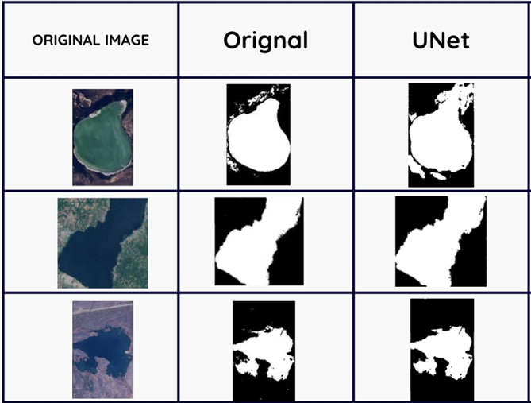

# DroughtVision: Satellite-Based Drought Detection System
Developed a U-Net model to segment water bodies from land and track temporal water-level changes, enabling early drought alerts through a threshold-based monitoring pipeline.

## System Architecture
This diagram illustrates the architecture of the U-net Model used in DroughtVision.

## Model Performance
Below is a visualization of model performance on sample images. 

## Real-Time Output
A screenshot showing how the model performs on real satellite imagery, highlighting segmented water bodies and detected drought signals.

